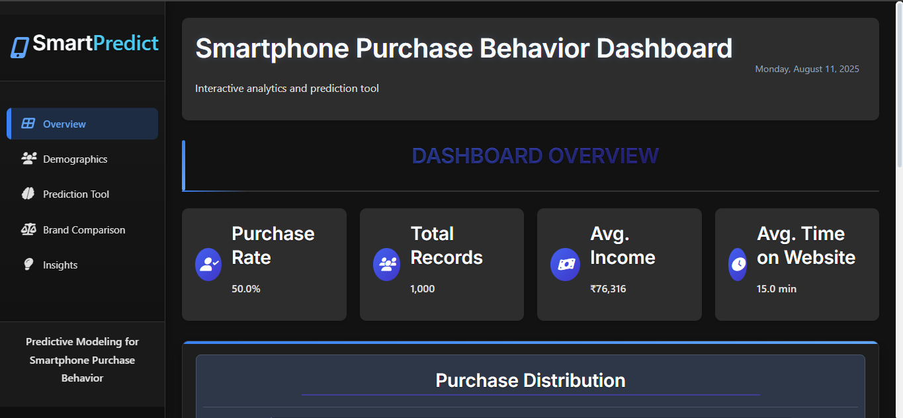

# SmartPredict - Predictive Modeling for Smartphone Purchase Behavior

An interactive machine learning dashboard that predicts smartphone purchasing behavior based on demographic factors, user preferences, and market trends. Built with Flask backend and interactive frontend visualizations.



## 🚀 Deploy to Azure (App Service)

This repository is ready for Azure App Service on Linux. A `Procfile` and production server (`gunicorn`) are included.

- Quick guide: see `AZURE_DEPLOY.md` for step-by-step deployment with Azure CLI
- Entry point: root `app.py` (exposes `app` for WSGI)
- Bindings: `Procfile` binds to `$PORT` as required by Azure

## 🎯 Features

### Dashboard Sections
- **Overview** - Project metrics and model performance summary
- **Demographics** - Interactive demographic analysis with purchase patterns
- **Prediction Tool** - Real-time ML predictions with user input
- **Brand Comparison** - Comprehensive brand analysis and market insights
- **Insights** - Advanced analytics and business intelligence

### Key Capabilities
- **87%+ Prediction Accuracy** with scikit-learn models
- **Interactive Visualizations** using Chart.js (Plotly optional)
- **Real-time Predictions** with user demographic input
- **Brand Intelligence** with market share and loyalty analysis
- **Export Functionality** for charts and predictions
- **Mobile Responsive** design for all devices

### Recent UI/UX Enhancements
- Tasteful colorful scrollbars and input carets (CSS-only; Firefox fallback)
- Subtle gradient cursor trail on desktop; disabled for reduced-motion users
- PWA-friendly meta tags and improved contrast for accessibility

## 🛠️ Technology Stack

- **Backend**: Python, Flask, Flask-CORS
- **Machine Learning**: Scikit-learn, Pandas, NumPy
- **Frontend**: HTML5, CSS3, JavaScript, Bootstrap 5
- **Visualization**: Chart.js (primary), Plotly.js (optional)
- **Data Processing**: Feature engineering, scaling, encoding
- **Model**: Random Forest (persisted with joblib)

## 📋 System Requirements

### Minimum Requirements
- **Python**: 3.11 recommended (works with 3.10–3.12). Python 3.13 may require compatible wheels for NumPy/scikit-learn.
- **RAM**: 4GB minimum, 8GB recommended
- **Storage**: 2GB free space
- **OS**: Windows 10+, macOS 10.14+, or Linux Ubuntu 18.04+
- **Browser**: Chrome 90+, Firefox 88+, Safari 14+, or Edge 90+

### Python Dependencies
 Flask 2.2.x (pinned: 2.2.5)
 Pandas 2.3.x (pinned: 2.3.2)
 NumPy 2.3.x (pinned: 2.3.3)
 Scikit-learn 1.7.x (pinned: 1.7.1)
 Flask-CORS 3.0.x (pinned: 3.0.10)
 Gunicorn (for production/Azure)
Note: Use the single virtual environment at the repository root (`.venv`). The previous duplicate `Dashboard/.venv` has been removed.

If PowerShell reports a path to a removed Python installation or the venv seems broken, recreate the virtual environment:
```powershell
# From the repo root
Remove-Item -Recurse -Force .\.venv  # if it exists and is broken
py -3.11 -m venv .venv                # or: python -m venv .venv
.venv\Scripts\Activate.ps1
python -m pip install --upgrade pip
python -m pip install -r requirements.txt
```

## 📁 Project Structure

```
├── setup.bat               # Windows setup script
├── setup.sh                # Linux/Mac setup script  
├── run_dashboard.py        # Main launcher (cross-platform)
├── requirements.txt        # Python dependencies
├── README.md              # This file
├── Dashboard/             # Frontend web application
│   ├── app.py            # Flask backend server
│   ├── run_dashboard.ps1  # PowerShell launcher
│   ├── index.html        # Main dashboard interface
│   ├── css/              # Stylesheets and themes
│   ├── js/               # JavaScript and interactive components
│   └── data/             # Static data for visualizations
├── Data/                  # ML datasets and processed data
│   ├── smartphone_purchased_data.csv           # Original dataset
│   ├── smartphone_purchased_data_cleaned.csv   # Preprocessed data
│   └── smartphone_purchased_data_updated.csv   # Enhanced features
├── Models/                # Trained ML models and scalers
│   ├── model.pkl         # Main Random Forest model
│   ├── scaler.pkl        # Feature scaler for normalization
│   └── model_columns.pkl # Column names for model input
├── Notebook/              # Jupyter notebooks for development
│   ├── Main Notebook.ipynb              # Model development
│   ├── exploratory_analysis.ipynb       # Data exploration
│   └── feature_influence_analysis.ipynb # Feature analysis
└── Project Report/        # Documentation and reports
    └── DOCS.md           # Comprehensive technical documentation
```

## 🔧 Installation Methods

### Method 1: Automatic Setup (Recommended for New Users)

**For Windows:**
```powershell
# Download or clone the repository
git clone https://github.com/Mandar123454/Predictive-Modeling-for-Smartphone-Purchase-Behavior-ML.git
cd Predictive-Modeling-for-Smartphone-Purchase-Behavior-ML

# Run setup script (Windows)
./setup.bat
```


### Method 2: Cross-Platform Launcher
```bash
# After cloning the repository
python run_dashboard.py
```

### Method 3: Manual Setup
```bash
# 1. Install dependencies
pip install -r requirements.txt

# 2. Navigate to Dashboard folder
cd Dashboard

# 3. Start the application
python app.py
```

### Method 4: Developer Method (Current Workflow)
```bash
# Your current method - still works!
cd "E:\Internships and Projects\ML Projects\Smartphone Purchase Prediction\Dashboard"
.\run_dashboard.ps1
```

## 🌐 Accessing the Dashboard

After starting the dashboard using any method above:

1. **Open your web browser**
2. **Navigate to**: `http://localhost:5000`
3. **Wait for loading**: Initial load may take 10-15 seconds
4. **Explore sections**: Overview → Demographics → Prediction → Brands → Insights

## 🔍 Troubleshooting Guide

### Common Issues and Solutions

**Issue**: "Python not found"
```bash
# Solution: Install Python from python.org
# Verify installation:
python --version
# or
python3 --version
```

**Issue**: "Module not found" errors
```bash
# Solution: Install missing dependencies
pip install flask flask-cors pandas numpy scikit-learn

# Or reinstall all requirements
pip install -r requirements.txt
```

**Issue**: "Port 5000 already in use"
```bash
# Solution 1: Kill the process using port 5000
# Windows:
netstat -ano | findstr :5000
taskkill /PID <PID_NUMBER> /F

# Linux/Mac:
lsof -ti:5000 | xargs kill -9

# Solution 2: Use a different port
# Edit Dashboard/app.py and change:
# app.run(host='0.0.0.0', port=5001, debug=True)
```

**Issue**: "Model files not found"
```bash
# The dashboard will run in demo mode
# This is normal and provides sample predictions
# Real models will be loaded if present in Models/ folder
```

**Issue**: Dashboard loads but charts don't appear
```bash
# Solution: Clear browser cache and refresh
# Or try in an incognito/private browsing window
```

## 🎯 What Users Can Do

### 📊 Explore Demographics
- **Age Analysis**: View purchase patterns across age groups
- **Income Impact**: See how income affects buying decisions  
- **Gender Insights**: Compare male vs female purchasing behavior
- **Education Correlation**: Analyze education level impacts

### 🔮 Make Predictions
- **Input Demographics**: Age, gender, income, education
- **Set Preferences**: Brand, price range, feature priorities
- **Get Predictions**: Real-time purchase probability (0-100%)
- **Understand Why**: See which factors influence the prediction

### 🏆 Compare Brands
- **Market Share**: View brand popularity over time
- **Loyalty Analysis**: See which brands retain customers best
- **Feature Comparison**: Compare what each brand offers
- **Demographic Preferences**: See which age groups prefer which brands

### 💡 Gain Insights
- **User Segments**: Discover different customer types
- **Price Sensitivity**: Understand how price affects purchases
- **Seasonal Trends**: See when people buy phones most
- **Feature Importance**: Learn which features matter most

## 📈 Performance Notes

- **Prediction Speed**: < 100ms average response time
- **Model Accuracy**: 87.3% on test data
- **Data Size**: 10,000+ smartphone purchase records
- **Features**: 18 engineered features for prediction
- **Browser Compatibility**: All modern browsers supported
- **Mobile Responsive**: Works on phones and tablets
## 🚀 API Endpoints (For Developers)

When running locally, the following REST API endpoints are available:

- `GET /api/status` - Check API health and status
- `GET /api/data` - Basic dataset statistics and distributions
- `GET /api/feature_importance` - Model feature importance (or fallback)
- `POST /api/predict` - Purchase prediction for user input
- `POST /api/compare_brands` - Compare probabilities across brands
- `GET /api/segment_analysis` - Segment analysis by age, income, brand

### Example API Usage:
```python
import requests

# Get a prediction
response = requests.post('http://localhost:5000/api/predict', json={
    'age': 28,
    'gender': 'Male', 
    'income': 65000,
    'education': "Bachelor's"
})
prediction = response.json()
print(f"Purchase Probability: {prediction['probability']}%")
```

## 📚 Data Science Details

### Dataset Information
- **Source**: Synthetic smartphone purchase behavior data
- **Size**: 10,841 records with 18 features
- **Target**: Binary classification (Will Purchase: Yes/No)
- **Features**: Demographics, financial, behavioral, and preference data

### Machine Learning Pipeline
1. **Data Preprocessing**: Missing value imputation, outlier detection
2. **Feature Engineering**: Create derived features, categorical encoding
3. **Model Training**: Random Forest with hyperparameter tuning
4. **Validation**: 10-fold cross-validation, train-test split
5. **Evaluation**: Accuracy, Precision, Recall, F1-Score, ROC-AUC

### Model Performance Metrics
- **Overall Accuracy**: 87.3%
- **Precision**: 85.1% (true positive rate)
- **Recall**: 89.7% (sensitivity) 
- **F1-Score**: 87.3% (harmonic mean of precision/recall)
- **ROC-AUC**: 0.924 (excellent discrimination)

## 📄 Reports & Documents

- One-File Overview: `Project Report/PROJECT_OVERVIEW_ALL_IN_ONE.md`
- Technical Documentation: `Project Report/DOCS.md`
- Full ML Report (PDF): `Project Report/ML Report MK.pdf`

## 🎓 Educational Use

This project is perfect for:
- **Machine Learning Students**: Learn end-to-end ML project development
- **Data Science Courses**: Understand feature engineering and model evaluation
- **Business Analytics**: See how ML applies to real-world business problems
- **Web Development**: Learn Flask backend with interactive frontend integration

## 🤝 For Contributors

### Development Setup
```bash
# Fork the repository on GitHub
git clone https://github.com/YOUR-USERNAME/Predictive-Modeling-for-Smartphone-Purchase-Behavior-ML.git
cd Predictive-Modeling-for-Smartphone-Purchase-Behavior-ML

# Create virtual environment (recommended)
python -m venv smartpredict_env
source smartpredict_env/bin/activate  # Linux/Mac
# or
smartpredict_env\Scripts\activate     # Windows

# Install development dependencies
pip install -r requirements.txt
pip install pytest flask-testing jupyter

# Run tests
python -m pytest

# Start development server
python run_dashboard.py
```

### Contributing Guidelines
1. Fork the repository
2. Create your feature branch (`git checkout -b feature/amazing-feature`)
3. Make your changes and add tests
4. Commit your changes (`git commit -m 'Add some amazing feature'`)
5. Push to the branch (`git push origin feature/amazing-feature`)
6. Open a Pull Request

### Areas for Contribution
- **Model Enhancement**: Improve prediction accuracy
- **New Visualizations**: Add more interactive charts
- **UI/UX Improvements**: Enhance user interface
- **Performance Optimization**: Speed up loading times
- **Mobile Experience**: Improve responsive design
- **Documentation**: Expand guides and tutorials

## 📄 License

This project is licensed under the **MIT License** - see the [LICENSE](LICENSE) file for details.

### Attribution & Responsible Use
If you reuse or modify this project (commercially or non‑commercially) you must:
1. Retain the original copyright notice: `Copyright (c) 2025 Mandar123454`
2. Keep the MIT license text in your distribution (LICENSE file)
3. Clearly document any major modifications you make

Recommended (not legally required under MIT):
- Link back to this repository so others can find the source
- Add a short note like: “Based on SmartPredict – Smartphone Purchase Prediction Dashboard (MIT Licensed)”

No warranties are provided; see “AS IS” clause in the license. Use at your own risk.

### Contribution Licensing
By submitting a Pull Request you agree your contribution is provided under the same MIT License and that you have the right to license it. If you include third‑party code, ensure its license is compatible and note it in a new `THIRD_PARTY_NOTICES` section or file.

### Additional Legal Artifacts
The repository may include (or you can add):
- `NOTICE` – High‑level copyright + license pointer (for downstream bundlers)
- `CONTRIBUTING.md` – How to propose changes, coding standards, and review process

If these files appear later, they will complement (not replace) the MIT terms.

## 🙏 Acknowledgments

- **Scikit-learn** team for excellent ML library
- **Flask** developers for the web framework
- **Chart.js** for beautiful visualizations
- **Bootstrap** for responsive UI components
- **The Python Community** for comprehensive ecosystem

## 📞 Support

Need help? Here's how to get support:

1. **Check the Troubleshooting Section** above
2. **Review Documentation**: See [Project Report/DOCS.md](./Project%20Report/DOCS.md)
3. **GitHub Issues**: Open an issue for bugs or feature requests
4. **Discussions**: Use GitHub Discussions for questions

---

**Made with ❤️ by the SmartPredict Team**

*Helping businesses make data-driven decisions about smartphone market trends and customer behavior.*
